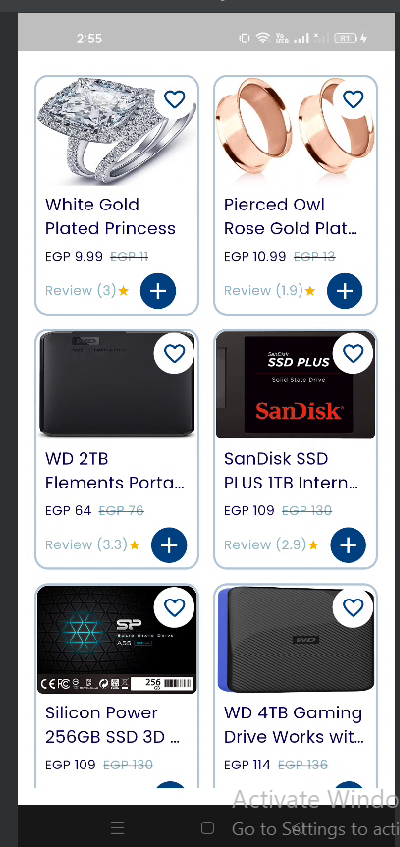

# elevate_tech_assessment

A Flutter application that displays a grid list of products fetched from the FakeStore API. This project demonstrates clean architecture principles, efficient state management, and modern Flutter development practices.

Screenshots

## Getting Started

This project is a starting point for a Flutter application.

A few resources to get you started if this is your first Flutter project:

This project follows Clean Architecture principles with a clear separation of concerns:
lib/
├── core/
│   ├── di/                    # Dependency Injection setup
│   ├── error/                 # Error handling
│   ├── network/               # Network configuration
│   └── utils/                 # Utility classes and extensions
├── data/
│   ├── models/                # Data models
│   ├── repositories/          # Repository implementations
│   └── sources/               # Data sources (remote/local)
├── domain/
│   ├── entities/              # Business entities/models
│   ├── repositories/          # Repository interfaces
│   └── usecases/              # Use cases for business logic
└── presentation/
    ├── blocs/                 # State management (Cubits)
    ├── pages/                 # Screen pages
    └── widgets/               # Reusable UI components

    
    Architecture Diagram
┌─────────────────┐      ┌─────────────────┐      ┌─────────────────┐
│                 │      │                 │      │                 │
│  Presentation   │      │     Domain      │      │      Data       │
│                 │      │                 │      │                 │
│  - Cubits       │◄────►│  - Use Cases    │◄────►│  - Repositories │
│  - Pages        │      │  - Entities     │      │  - Models       │
│  - Widgets      │      │  - Repositories │      │  - Data Sources │
│                 │      │    (interfaces) │      │                 │
└─────────────────┘      └─────────────────┘      └─────────────────┘
        ▲                                                 ▲
        │                                                 │
        └─────────────────────┬─────────────────────────┘
                              │
                      ┌───────────────┐
                      │               │
                      │     Core      │
                      │               │
                      │ - DI          │
                      │ - Networking  │
                      │ - Error       │
                      │ - Utils       │
                      │               │
                      └───────────────┘
Setup Instructions
Prerequisites

Flutter SDK (latest stable version)
Dart SDK (latest stable version)
Android Studio / VS Code
Git

  Installation

Clone the repository:

bashgit clone https://github.com/wasimGhoniem/Elevate-Tech-Assessment.git

Navigate to the project directory:

bashcd Elevate-Tech-Assessment

Get dependencies:

bashflutter pub get

Run the code generation for injectable:

bashflutter pub run build_runner build --delete-conflicting-outputs

Run the app:

bashflutter run

- [Lab: Write your first Flutter app](https://docs.flutter.dev/get-started/codelab)
- [Cookbook: Useful Flutter samples](https://docs.flutter.dev/cookbook)

For help getting started with Flutter development, view the
[online documentation](https://docs.flutter.dev/), which offers tutorials,
samples, guidance on mobile development, and a full API reference.
